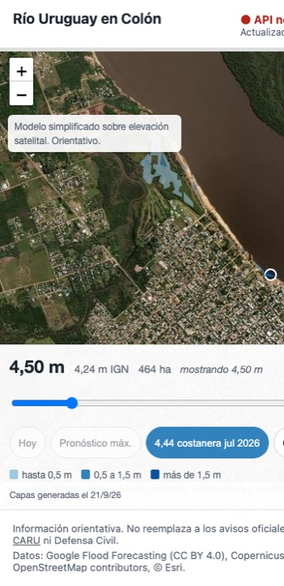
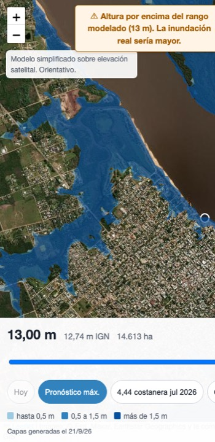
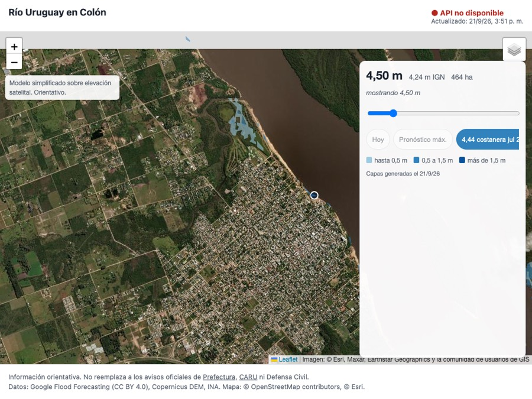
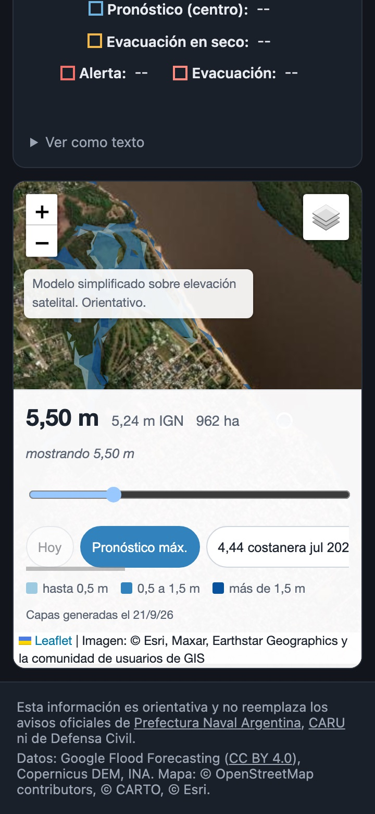
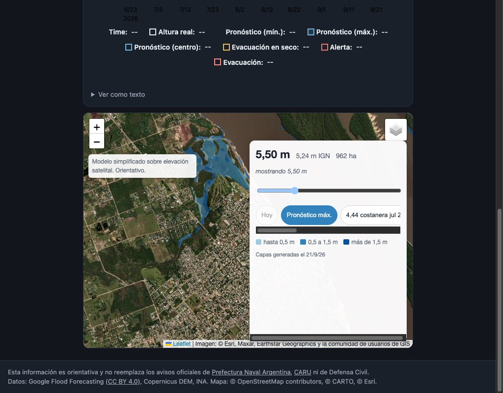
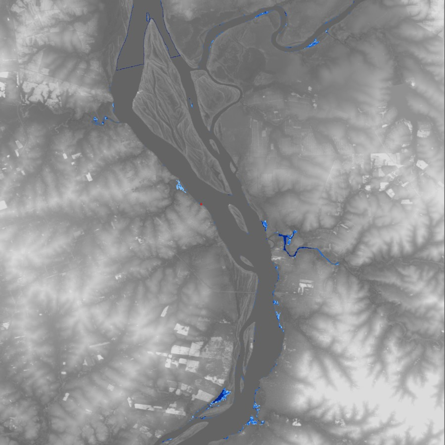

# 006 — Capas de inundación y mapa interactivo

- **Estado:** en revisión
- **Rama:** feat/006-mapa-inundacion
- **Depende de:** 001
- **Puede ir en paralelo con:** 002, 003, 005

## Objetivo

Llevar a la app el mapa de inundación que validamos en el notebook: zonas que se inundan en Colón según la altura del puerto, con slider, escenarios reales y la altura pronosticada.

## Alcance

### A. Geoprocessing (offline, `geoprocessing/`)

1. Script `geoprocessing/generar_capas.py` (dependencias propias en `geoprocessing/pyproject.toml`, fuera del workspace de la app: `rasterio`, `numpy`, `scipy`, `shapely`, `affine`).
2. Método (el mismo del notebook):
   - DEM Copernicus GLO-30: `https://copernicus-dem-30m.s3.amazonaws.com/Copernicus_DSM_COG_10_S33_00_W059_00_DEM/Copernicus_DSM_COG_10_S33_00_W059_00_DEM.tif`, recorte `BBOX = (-58.25, -32.30, -58.05, -32.15)`.
   - Remuestreo ×3 (bilineal) para suavizar bordes.
   - Cota del agua = altura del puerto + `CERO_IGN` (−0,26 m, parámetro).
   - Inundado = celdas ≤ cota **conectadas al río**, con semilla en el punto más bajo cerca de `(-58.11, -32.22)`.
   - Se descuenta el río normal: nivel base = máx(`2,2 + CERO_IGN`, cota del río en el DEM + 0,3).
   - Profundidad en 3 clases: ≤ 0,5 m / 0,5–1,5 m / > 1,5 m.
3. Salida en `frontend/public/capas/`:
   - Un GeoJSON por altura de 3,00 a 10,50 m cada 0,25 m (`h_0450.geojson`, etc.), polígonos simplificados (tolerancia ~0,00004°) y coordenadas con 5 decimales.
   - `index.json` con `[{h, archivo, hectareas}]` y metadatos (`cero_ign`, fecha de generación, fuente del DEM).
   - Tamaño total ≤ 15 MB. Si se pasa, aumentar la simplificación y documentarlo.
4. README en `geoprocessing/` con cómo regenerar y cómo calibrar `CERO_IGN`.

### B. Módulo de mapa (`frontend/src/map.ts` y `frontend/src/capas.ts`)

1. Base satelital Esri + capa "Calles" OSM (como está hoy), más etiquetas si hay un proveedor sin key.
2. Capa de inundación cargada **bajo demanda** (fetch del GeoJSON de la altura elegida, con caché en memoria). Colores por profundidad y leyenda.
3. **Slider** de altura (3,00 a 10,50 m, paso 0,25) con la altura, la cota y las hectáreas.
4. **Botones de escenarios**: Hoy (altura actual), Pronóstico máx., 4,44 m costanera (jul 2026), 6,80 evacuación en seco, 7,10 alerta, 7,60 crecida jun 2025, 7,90 evacuación, 9,06 máximo mayo 2024.
5. **API pública del módulo** (la usa la spec 005):
   - `setNivelActual(h: number)` y `setNivelPronosticado(h: number)`: habilitan esos botones y, si el usuario no tocó nada, el mapa arranca en el pronosticado.
   - Redondeo al paso de 0,25 más cercano, informado en la UI ("mostrando 5,75 m").
6. Marcador del hidrómetro del puerto en `(-32.2147, -58.1370)`.
7. Aviso dentro del mapa: "Modelo simplificado sobre elevación satelital. Orientativo."

## Fuera de alcance

- "Mi casa" (altura a la que se moja cada punto): spec posterior, usando la misma base.
- Tarjetas de estado y gráfico (spec 005).
- Backend.

## Diseño / decisiones

- El DEM crudo y temporales van a `geoprocessing/data/` (en `.gitignore`). Solo se versionan las capas finales.
- Las capas se generan a mano y se commitean; la app no procesa el DEM.
- Sin dependencias nuevas en el frontend (Leaflet ya está).

## Archivos compartidos que puede tocar

- `frontend/src/map.ts` (es de esta spec), nuevo `frontend/src/capas.ts`, `frontend/public/capas/`.
- `.gitignore` solo si falta `geoprocessing/data/`.
- NO tocar `frontend/src/main.ts` salvo lo mínimo para exportar el módulo; el layout es de la spec 005.

## Criterios de aceptación

- [x] `generar_capas.py` corre de punta a punta y genera las capas + `index.json` (36 capas: 3,00–10,50 cada 0,25 y 11,00–13,00 cada 0,5; ver "Cambios acordados" en Hallazgos).
- [x] Sanidad: las hectáreas crecen de forma monótona con la altura (verificado sobre `index.json`); a 4,44 m (capa 4,50) aparece agua en la costanera del puerto (capturas abajo).
- [x] Tamaño total de capas ≤ 15 MB (13,89 MB).
- [x] El slider cambia de capa en < 300 ms con la capa en caché (medido 4–24 ms en Chrome headless, ver "Cómo verificar").
- [x] `setNivelPronosticado` y `setNivelActual` testeados (Vitest, `frontend/src/capas.test.ts`).
- [x] Se ve y se usa bien a 360 px (capturas abajo).
- [x] `ruff`, `pytest`, `pnpm build` y `pnpm test` pasan.

### Capturas

| 360 px, arranque en 4,44 m (capa 4,50) | 360 px, altura fuera de rango (14 m) |
|---|---|
|  |  |

Escritorio (1024 px): 

Las tres capturas de arriba son del módulo suelto, antes del rebase sobre la spec 005. Ya integrado
en el dashboard, el mapa es la última tarjeta y el panel se acopla a la derecha por encima de 768 px:

| Integrado, 360 px | Integrado, 1024 px |
|---|---|
|  |  |

Ambas con el sistema en modo oscuro, que es donde aparecieron los defectos de contraste (Hallazgos 5 y 6).
El slider arranca en "Pronóstico máx." porque la 005 le pasa la altura estimada; "Hoy" queda
deshabilitado hasta que haya altura real.

Validación a ojo de la capa 4,50 m rasterizada sobre el DEM (azul = agua nueva por clase, cruz roja = hidrómetro): 

## Cómo verificar

```bash
# Geoprocessing (proyecto uv independiente, fuera del workspace)
uv run --project geoprocessing pytest geoprocessing/tests -q          # 27 tests, numpy puro
uv run --project geoprocessing python geoprocessing/generar_capas.py -v # ~12 min; baja el DEM la primera vez
du -ch frontend/public/capas/*.geojson | tail -1                      # ≤ 15 MB (13,89 MB)
python3 -c "import json;d=json.load(open('frontend/public/capas/index.json'));hs=[c['hectareas'] for c in d['capas']];print(len(hs),all(a<=b for a,b in zip(hs,hs[1:])),d['paso'],d['rio_base'])"
# → 36 True {'hasta_1050': 0.25, 'sobre_1050': 0.5} {'nivel_base_ign': 2.3, 'hectareas': 5247.2, 'segmentos_planos_absorbidos': 1}

# Corrida corta para iterar (usa el DEM cacheado, no pisa las capas versionadas)
uv run --project geoprocessing python geoprocessing/generar_capas.py --no-expand --levels 3.0,4.5,7.5 --out /tmp/capas_test

# Checks del repo
uv run ruff check . && uv run ruff format --check .
uv run pytest -q                       # backend + worker + scripts (geoprocessing no se recolecta acá)
pnpm -C frontend build && pnpm -C frontend test   # 71 tests tras el rebase (23 nuevos en capas.test.ts)

# A mano en el navegador (scripts/wt-env.sh define WEB_PORT)
pnpm -C frontend dev
# - Abrir a 360 px: el mapa arranca en 4,44 m ("mostrando 4,50 m"), con agua en la costanera del puerto.
# - Mover el slider: la capa cambia sin recargar; "mostrando X m" aparece cuando se redondea al paso.
# - En la consola: window.mapaInundacion.setNivelPronosticado(14) → capa de 13 m + aviso
#   "Altura por encima del rango modelado (13 m). La inundación real sería mayor."
# - window.mapaInundacion.setNivelActual(3.7) habilita "Hoy" sin mover el mapa.
```

Medición del cambio de capa en caché (Chrome headless vía CDP, `MutationObserver` sobre el pane de
overlays hasta el siguiente frame): 7,75 → 24 ms, 7,50 → 5 ms, 7,25 → 5 ms, 10,25 → 14 ms,
11,00 → 19 ms. Las capas se precargan de a vecinas (h ± paso) apenas llega la actual.

## Hallazgos

**Cambios acordados sobre la spec original (Leandro, 2026-09-21):** capas de 3,00 a 13,00 m; si el total
supera 15 MB, paso 0,5 por encima de 10,50 (pasó: 41 capas = 17,3 MB → 36 capas = 13,9 MB). Altura
mayor al máximo modelado → capa máxima con aviso visible, nunca recorte silencioso. `toca_borde`
calculado sobre el agua nueva (sin el río normal), ampliación automática del BBOX solo por este/oeste
(hubo 1 ampliación al este: BBOX final `[-58.25, -32.35, -58.00, -32.10]`), margen fijo de 0,05° al
norte y al sur aplicado una sola vez; el contacto norte/sur se registra por capa en `index.json` y
queda como advertencia documentada (el río cruza el recorte).

Encontrado durante la implementación (dentro del alcance, ya resuelto):

1. **Costura del DEM en el río.** Copernicus aplana los cuerpos de agua a un valor constante por
   segmento: el río vale 2,0 m en el puerto y 2,5 m aguas arriba de las islas (lon −58,18…−58,15,
   lat −32,14…−32,10). Con el método literal del notebook, esa meseta de ~590 ha aparecía como agua
   nueva "de más de 1,5 m" desde los 3,00 m (682 ha a 3,00 m; ahora 66 ha). `generar_capas.py`
   absorbe al río base las mesetas planas pegadas al río (≥ 5 ha, < 1,5 m sobre el nivel base) y
   lo documenta en `index.json` (`rio_base`) y en el README.
2. **Columna nodata en el borde este.** Al unir tiles con `bounds` justo en −58,00, `rasterio.merge`
   deja una columna en 0 m que habría actuado como canal falso. Se recortan bordes vacíos y los 0
   restantes se tratan como sin dato.
3. **Tolerancia de simplificación.** Con 0,00004° (la del notebook) el tamaño no bajaba: el peso
   estaba en la fragmentación (conectividad 4 del polygonizado vs. relleno de 8) y en la "escalera"
   del ráster. Se vectoriza con conectividad 8, se limpian componentes < 0,1 ha y huecos < 0,2 ha,
   y la tolerancia por defecto queda en 0,0002° (~2 píxeles tras el remuestreo ×3, ≈ 20 m). A la
   escala del celular no se nota; si en una spec futura se quiere más detalle en el casco urbano,
   la vía es una capa aparte de mayor resolución para el centro, no bajar la tolerancia global.

Encontrado al integrar con `main` (rebase sobre la spec 005, ya resuelto):

4. **El mapa se monta dentro del layout de la 005, no sobre un `#map` propio.** La 006 se escribió
   contra un `main.ts` que creaba su propio contenedor y asignaba `window.mapaInundacion`. En `main`
   ese archivo es de la 005, que ya trae el puente defensivo `components/mapa.ts`: importa `./map`
   de forma diferida y llama `createMap(container)` y, si existe, `setNivelPronosticado` **del
   módulo**. Se resolvió a favor del layout de la 005 (lo que pedía la spec) y `map.ts` pasó a
   exponer `setNivelActual` / `setNivelPronosticado` a nivel de módulo, delegando en la última
   instancia creada; `createMap` publica esa instancia en `window.mapaInundacion`. Sin ese puente el
   mapa se montaba pero se quedaba en 4,44 m fijo, ignorando el pronóstico.

5. **Contraste ilegible en modo oscuro.** Ninguna de las dos specs lo tenía sola: la 005 agregó el
   bloque `prefers-color-scheme: dark` y los overlays de la 006 fijan superficie clara pero heredaban
   `--fg` / `--muted`. Resultado: la lectura principal del panel quedaba en 1,15:1 (texto casi blanco
   sobre panel casi blanco). Los overlays ahora fijan sus propios tokens claros: 15,2:1 el número
   principal, 5,8:1 los secundarios (AA pide 4,5:1).

6. **La hoja inferior tapaba la atribución de Leaflet a 360 px.** Ambas se anclan al borde inferior.
   Subir el `z-index` de `.leaflet-control-attribution` no alcanza porque Leaflet arma contexto de
   apilamiento en `.leaflet-bottom`: hay que subirlo en ese ancestro. Se hizo eso y se reservó lugar
   en el panel (8 px de separación medidos). Arriba de 768 px el panel se acopla a la derecha y nunca
   hubo solapamiento.

Fuera de alcance (no se tocó):

- **CI:** `.github/workflows` corre solo `uv run pytest` del workspace; los tests de geoprocessing
  (`uv run --project geoprocessing pytest geoprocessing/tests`) no corren en CI. Agregarlos es una
  línea en el workflow, pero es archivo compartido.
- **Datum EGM2008 ↔ IGN** sigue sin resolver de forma independiente: se absorbe con `CERO_IGN`
  (README de geoprocessing explica cómo calibrarlo con los eventos 4,44 m y 9,06 m).
- **Etiquetas del mapa:** no se agregó capa de etiquetas (no hay proveedor sin key evaluado);
  quedan las bases Satélite (Esri) y Calles (OSM).
- **Tipos GeoJSON:** `@types/geojson` no está hoisteado por pnpm, así que `capas.ts` define un tipo
  mínimo propio en vez de sumar dependencia. Si la spec "Mi casa" necesita más, conviene agregar
  `@types/geojson` explícitamente.
- **Tamaño del DEM de prueba:** los tests de geoprocessing son con DEM sintético; no hay fixture
  real chico. Alcanza para la lógica, no para regresiones de calibración.

## Resumen final

Capas de inundación 3,00–13,00 m del DEM Copernicus (36 GeoJSON, 13,9 MB, paso 0,5 sobre 10,50 por presupuesto) con `geoprocessing/generar_capas.py`, tests y README; se corrigieron dos artefactos del DEM (costura del río a 2,5 m y columna nodata) que inflaban las hectáreas bajas.
Módulo de mapa (`capas.ts` puro + `map.ts` Leaflet): slider, escenarios, leyenda, hidrómetro y avisos de modelo y de fuera de rango; API expuesta en `window.mapaInundacion` y a nivel de módulo para el puente de la 005.
Al integrar con la 005 se corrigieron el cableado del pronóstico y dos defectos de modo oscuro: panel ilegible (1,15:1 → 15,2:1) y la hoja inferior tapando la atribución de Leaflet.
Verificado sobre `main` ya rebaseado: ruff, 138 tests py, 27 geo, 71 web, build; cambio de capa en caché 2–9 ms.
Pendiente fuera de alcance: tests geo en CI, calibración del datum, capa de etiquetas.
